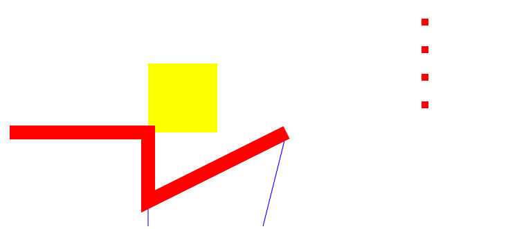
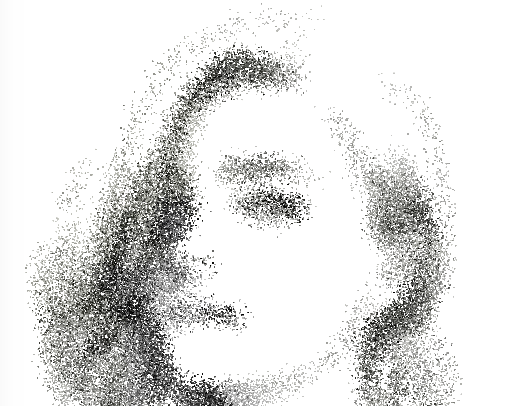

# [MiniGL](https://mizy.github.io/MiniGL)
A 2d WebGL renderer，
+ support point,line,face,instanceMesh and custom shader
+ support canvas transform & controller
+ support webGL2.0
+ use glMatrix as matrix library
+ support DragonBones animation
 



# case
+ [basic shape](https://mizy.github.io/MiniGL/demo/main.html)
+ point
	* [point color](https://mizy.github.io/MiniGL/demo/points/points.html)
	* [point shrink](https://mizy.github.io/MiniGL/demo/points/shrink.html)
+ line
  * [fly line animation](https://mizy.github.io/MiniGL/demo/line/flyline.html)
	* [meshline](https://mizy.github.io/MiniGL/demo/line/meshline.html)
+ face
	* [image](https://mizy.github.io/MiniGL/demo/image/index.html)
+ shader
	* [custom shader](https://mizy.github.io/MiniGL/demo/customShader/index.html)
+ InstanceMesh(webGL2)
	* [instanceMesh](https://mizy.github.io/MiniGL/demo/instanceMesh/index.html)
  * [instanceArrow](https://mizy.github.io/MiniGL/demo/arrow/arrow.html)
+ DragonBones animation
	* [dragonbone demo](https://mizy.github.io/MiniGL/demo/dragonBones/index.html)
  * [dragonbone eyetrack demo](https://mizy.github.io/MiniGL/demo/dragonBones/eyetrack.html)
* game

## shader uniform
the uniform below will be auto append to shader
```
    uniform mat3 transform; // model transform matrix
    uniform mat3 modelView; // modelView matrix
    uniform float pixelRatio; //
    uniform float ratio; // canvas width/height
```
such as:
```
    vec3 mPosition = transform * modelView * vec3(position,1.);
```
you can use config.z to change the order of meshes
```
    vec3 mPosition = transform * modelView * vec3(position,z);
```

# develope
```
npm i
npm run start
```
# doc
[doc](https://mizy.github.io/MiniGL/docs/index.html)

# future
maybe it will be a new origin webgl skia-like lib
